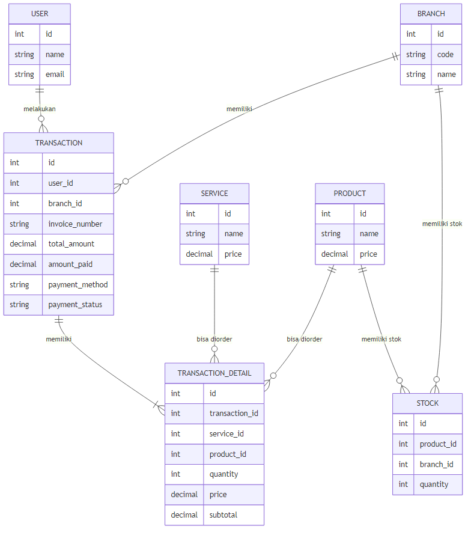
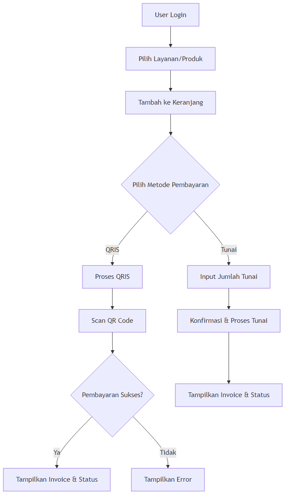

# Dokumentasi Kulmn Barbershop POS Web App

## Deskripsi Singkat

Aplikasi web ini adalah sistem Point of Sale (POS) untuk Barbershop Kulmn, dibangun menggunakan Laravel. Sistem ini mendukung transaksi layanan dan produk, pembayaran tunai maupun QRIS (Midtrans), serta manajemen stok produk per cabang.

---

## Fitur Utama

-   **Transaksi POS**:

    -   Pilih layanan dan produk, tambahkan ke keranjang, atur jumlah.
    -   Mendukung pembayaran **tunai** dan **QRIS** (scan QR code).
    -   Otomatisasi perhitungan total, kembalian, dan status pembayaran.
    -   Notifikasi status pembayaran (berhasil, gagal, menunggu).
    -   Setiap transaksi menghasilkan nomor invoice unik.

-   **Manajemen Produk & Layanan**:

    -   Data layanan dan produk diambil dari database (hanya yang aktif).
    -   Stok produk otomatis berkurang saat transaksi tunai.

-   **Manajemen Cabang**:

    -   Setiap user terhubung ke cabang tertentu.
    -   Transaksi dicatat berdasarkan cabang.

-   **Panel Admin (Filament)**:

    -   CRUD untuk cabang, produk, layanan, stok, transaksi, user.
    -   Statistik dan laporan transaksi.

-   **Keamanan**:
    -   Autentikasi user (login).
    -   Validasi input dan sanitasi data.
    -   Proteksi dasar terhadap inspect element (untuk user awam).

---

## Teknologi yang Digunakan

-   **Backend**: Laravel 10.x
-   **Frontend**: Blade Templates, Tailwind CSS, JavaScript
-   **Database**: MySQL
-   **Pembayaran**: Midtrans QRIS
-   **Manajemen Paket**: Composer (PHP) & Node.js/npm (JavaScript)
-   **Kompilasi Aset**: Vite

---

## Instalasi & Setup

1. **Clone repositori:**
    ```bash
    git clone <repository_url>
    cd kulmn
    ```
2. **Instal dependensi:**
    ```bash
    composer install
    npm install
    ```
3. **Salin file environment & generate key:**
    ```bash
    cp .env.example .env
    php artisan key:generate
    ```
4. **Konfigurasi database dan Midtrans di file `.env`.**
5. **Migrasi & seed database:**
    ```bash
    php artisan migrate
    php artisan db:seed
    ```
6. **Jalankan Vite & server Laravel:**
    ```bash
    npm run dev
    php artisan serve
    ```

Aplikasi akan berjalan di `http://127.0.0.1:8000`.

---

## Cara Penggunaan POS

1. **Login** ke aplikasi.
2. Masuk ke halaman **POS** (`/pos`).
3. Pilih **layanan** atau **produk** yang diinginkan, tambahkan ke keranjang.
4. Atur jumlah item di keranjang.
5. Pilih metode pembayaran:
    - **QRIS**: Klik "Bayar dengan QRIS", scan QR code, tunggu status pembayaran otomatis.
    - **Tunai**: Klik "Bayar Tunai", masukkan jumlah uang, proses pembayaran, dan lihat kembalian.
6. Setelah transaksi berhasil, invoice dan status akan tampil.

---

## Struktur Proyek

```
kulmn/
├── app/
│   ├── Filament/           # Panel admin
│   ├── Http/Controllers/   # Controller aplikasi & API
│   ├── Models/             # Model Eloquent
│   └── Services/           # Logika bisnis
├── database/
│   ├── migrations/         # Migrasi database
│   └── seeders/            # Seeder database
├── public/
│   └── img/                # Gambar statis
├── resources/
│   └── views/              # Blade templates (POS, dashboard, dll)
└── routes/
    └── web.php             # Rute web
```

---

## API Endpoint Penting

-   `POST /api/create-qris-transaction` — Buat transaksi QRIS (Midtrans)
-   `POST /api/create-cash-transaction` — Buat transaksi tunai
-   `GET /api/services` — Daftar layanan aktif
-   `GET /api/products` — Daftar produk aktif
-   `GET /api/transaction-status/{invoice_number}` — Cek status transaksi

---

## ERD (Entity Relationship Diagram)



---

## Flowchart Proses Transaksi POS



---

## Kontribusi

Kontribusi sangat diterima! Silakan fork repositori dan kirimkan pull request.

---

## Lisensi

Proyek ini dilisensikan di bawah [Lisensi MIT](https://opensource.org/licenses/MIT).

---

## Dukungan

Untuk pertanyaan atau dukungan, silakan hubungi:

-   Email: deniasitudimas@gmail.com
